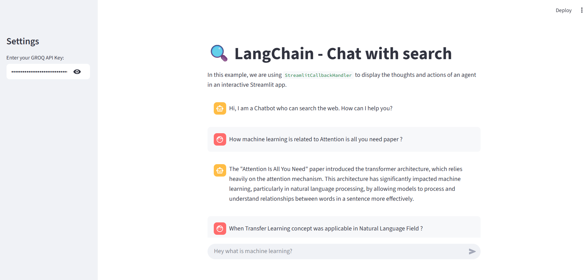

# 🧠 Agent Chatbot — Web Search Powered by Tools + Agents + LangChain



This chatbot acts like a search engine with **agent-powered tools** to fetch real-time information from **Wikipedia**, **ArXiv**, and **DuckDuckGo**. Built using **LangChain Agents** and **GROQ's Gemma model**, it simulates dynamic reasoning to respond based on the best tool for the query.

---

## ✨ Features

- 🌍 Web-augmented chatbot using search tools
- 🤖 Uses `ZERO_SHOT_REACT_DESCRIPTION` agent from LangChain
- 📚 Integrates with:
  - Wikipedia
  - ArXiv API
  - DuckDuckGo Search
- ⚡ Streamlit UI with live agent actions via `StreamlitCallbackHandler`
- 🔐 Secure API Key input using sidebar

---

## 📦 Tech Stack

- [LangChain Agents](https://python.langchain.com/)
- [Streamlit](https://streamlit.io/)
- [GROQ + Gemma Model](https://groq.com/)
- [DuckDuckGo API](https://duckduckgo.com/)
- [Wikipedia API](https://www.mediawiki.org/wiki/API:Main_page)
- [ArXiv API](https://arxiv.org/help/api/index)
- Python 3.10+

---

## ⚙️ Setup Instructions

### 1. Clone the Repository

```bash
git clone https://github.com/your-username/agent-chatbot-search.git
cd agent-chatbot-search
```

### 2. Create a Virtual Environment

```bash
python -m venv env
```

Or using Conda:

```bash
conda create -p venv python=3.10 -y
```

### 3. Activate the Environment

- **Windows**:
  ```bash
  .\env\Scripts\activate
  ```
- **macOS/Linux**:
  ```bash
  source env/bin/activate
  ```

### 4. Install Requirements

```bash
pip install -r requirements.txt
```

### 5. Set Up Environment Variables

Create a `.env` file in the root directory:

```env
GROQ_API_KEY=your_groq_api_key
```

### 6. Run the Application

```bash
streamlit run app.py
```

---

## 🖼️ Sample UI

> Replace the placeholder below with your own screenshot or gif inside the `assets/` folder.


---

## 📁 File Structure

```
agent-chatbot-search/
├── app.py
├── requirements.txt
├── .env.example
├── tools/
│   ├── arxiv_tool.py
│   ├── wikipedia_tool.py
│   └── duckduckgo_tool.py
├── README.md
└── assets/
    └── agent-chatbot-demo.png
```

---

## 🙋‍♂️ Contributing

Pull requests and suggestions are welcome!

---

## 📬 Contact

- **Author**: Anas Malik  
- **LinkedIn**: [linkedin.com/in/anas-malik-01](https://linkedin.com/in/anas-malik-01)

---

> Built with 🧠 using Agents + Tools + LangChain + Streamlit
